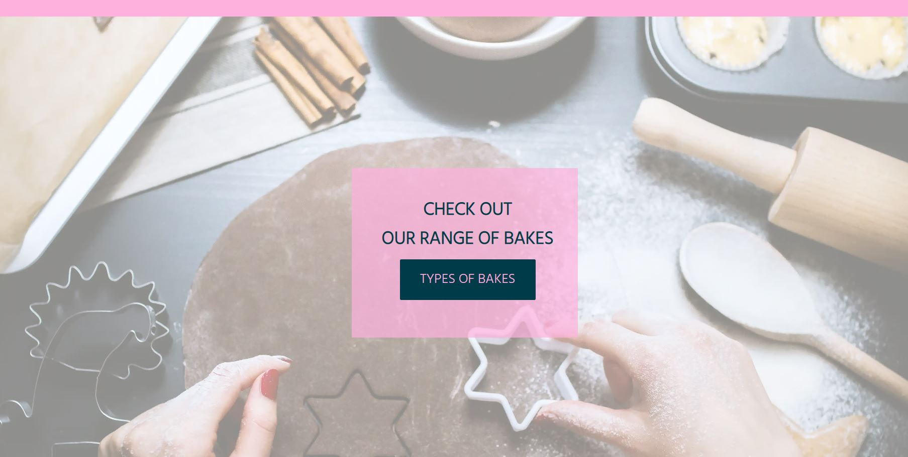
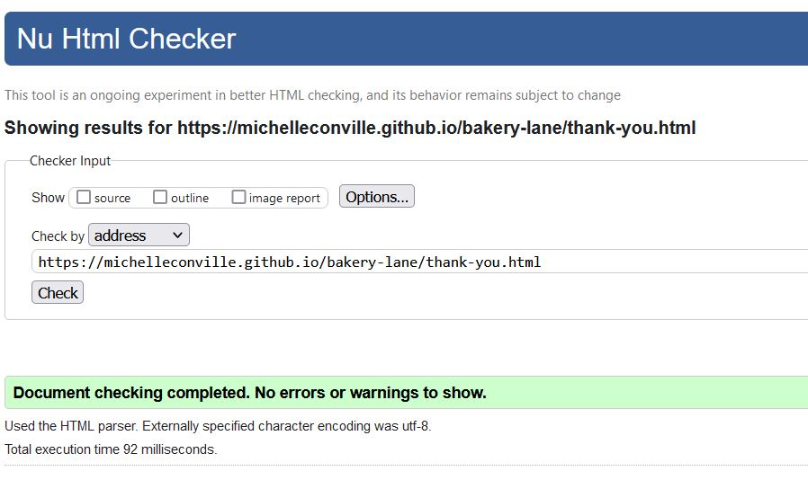

# Bakery Lane

## Table of Content

1. [Project Overview](#project-overview)
    1. [Company goals](#company-goals)
    2. [Customer goals](#Customer-goals)
2. [User Experience](#user-experience)
    1. [User Expectations](#user-expectations)
    2. [User Stories](#user-stories)
3. [Design](#design)
    1. [Colour Palette](#colour-palette)
    2. [Fonts](#fonts)
    3. [Structure](#structure)
    4. [Wireframes](#wireframes)
4. [Features](#features)
    1. [Site Wide](#site-wide)
    	1. [Navigation bar](#navigation-bar)
	    2. [Footer](#footer)
	    3. [Favicon](#favicon)
	    4. [404 Page](#404-page)
    2. [Landing page](#landing-page)
        1. [Landing page image and call to action button](#landing-page-image-and-call-to-action-button)
	    2. [Types of cakes](#types-of-cakes)
	    3. [Flavours](#flavours)
    3. [About page](#about-page)
    4. [Gallery page](#gallery-page)
    5. [Contact page](#contact-page)
    	1. [Contact form](#contact-form)
	    2. [Thank-you message](#thank-you-message)
    6. [Future features](#future-features-to-be-implemented)
    	1. Order form](#order-form)
	    2. [Blog](#blog)
5. [Testing](#testing)
    1. [Validation](#validation)
    	1. [HTML Validation](#html-validation)
	    2. [CSS Validation](#css-validation)
        3. [Accessibility](#accessibility)
        4. [Performance](#performance)
    2. [Browser compatability](#browser-compatability)
    3. [Testing User Stories](#testing-user-stories)
    4. [Bugs](#bugs)
6. [Deployment](#deployment)
    1. [Project creation](#project-creation)
	2. [Deployment to Github Pages](#deploymentto-github-pages)
7. [Technologies Used](#technologies-used)
    1. [Languages Used](#languages-used)
	2. [Programs Used](#programs-used)
8. [Credits](#credits)
    1. [Media](#media)
	2. [Code](#code)
9. [Acknowledgements](#acknowledgements)

## Project Overview
Project 1 for Code Institute Full-stack development program: HTML/CSS Essentials

View the [Live site](https://michelleconville.github.io/bakery-lane/index.html)

This project is a front-end website for an online bakery. 
A company's online presence can have a significant impact on its success, regardless of its industry. 
This website's main goal is to show users the bakery and introduce new customers to the brand. A contact form and social media channels allow users to interact with the bakery on the website, which is interactive and easy to use.

### Company goals
1.	Create an online presence for a bakery
2.	Provide a way for customers to contact the bakery
3.	Provide information about the bakery to customers

### Customer goals
1.	Find information about the bakery
2.	Be able to easily contact the bakery

## User Experience (UX)

### User Expectations 
*   User-friendly and intuitive to navigation
*   Fast site performance
*   Accessible to all users
*   Responsive across devices

### User Stories
First time users
1.	I want to be able to find the types of cakes that are available
2.	I want to be able to contact the bakery
3.	I want to be able to find out more information about the bakery

Returning User
4.	I want to know what type of flavour cakes that are made at the bakery
5.  I want to follow the bakery on social media
6.  I want to be able to see samples of cakes that have been created

Site Owner
7.  I want users to get to know more about the bakery
8.	I want the users to be able to contact us
9.  I want users to follow us on social media

## Design
### Color Pallette

*   Cotton candy #FEB1DD
*   Midnight green #003B4A 
*   Piggy Pink #FFE1EF
*   White #FFF
*   Onyx #3C3C3C

Cotton candy is used through out the site, mainly on the navigation bar and the footer. 
The midnight green is used for the text which includes the logo. 
Piggy pink, White and Onyx are used as background colours. All colours are used to style the buttons. 

### Fonts
The fonts used are Montserrat and Hind. 
Montserrat is used for the logo and the headers and Hind for the rest of the website. 
Fonts were imported from [Google Fonts](https://fonts.google.com/). The backup font of sans-serif was used incase the fonts do not load for the user.

### Structure
The *Bakery Lane* website is structured in a user friendly and easy to learn way. Upon arriving to the website, the user sees a navigation bar with the logo on the left-hand side and the navigation links to the right. The navigation bar and footer is located on all pages created.

The website consists of four pages:
*   The homepage has a hero image with a call-to-action button and two sections for types of cakes and flavours
*   An About Us page with a hero image, information about the bakery 
*   A gallery page with images highlighting the different kinds of cakes the bakery sells
*   A Contact Us page with a contact form

A thank you page when a user completes the contact us form and 404 page are also available.

### Wireframes
 

Homepage

 

 

About Us page

 

Gallery page

 

Contact Us page

 

Thank-you page

 

404 error page

## Features 
### Site wide

All site wide features will be fully responsive on all devices.

#### Navigation Bar
*   This will contain the bakery logo and links to the Home, About Us, Gallery and Contact Us pages and will be responsive on all devices. 
    *   The logo will be linked to the landing page for ease of use for the user, no matter what page the user is on, By clicking on the logo, the user will be brought back to the landing page.
    *   In the navigation bar, a line will appear under the page that the user so they always know were they are on the website.
*   This will allow users to easily navigate between the pages within the site on any size device.

#### Footer
*   This will contain both the contact information and the social media information for *Bakery Lane*. The social media websites will open in new tabs and be accessible to the visually impaired who may be using a screen reader, by the use of aria labels. 
*   This will allow the user to follow *Bakery Lane* on various social media where they can get more up to date information that may not be displayed on the website. The contact information will allow the user to contact *Bakery Lane* directly.

#### Favicon
*   A site wide favicon will be implemented with the letter B for *Bakery Lane* using the same pink colour that is used in the navigation of the site.
*   This will provide an image in the tabs header to allow the user to easily identify the website if they have multiple tabs open.

#### 404 Page
*   A 404 page will be implemented and will display if a user navigates to a broken link.
*   The 404 page will allow the user to easily navigate back to the main website if they direct to a broken link / missing page, without the need of the browsers back button.

### Landing page
####	Landing page image and call to action button
*   An image will be carefully chosen for the background to make the landing page stand out from other websites, within the image there will be a text box and button to direct the user to the types of cakes *Bakery Lane* provides.
*   This will help to immediately show the user what the website is about.

#### Types of cakes
*   This section will be made up of three areas, Birthday Cakes, Tasty Treats and Bespoke Cakes. Each area will show an image, a short description and a link to a specific area to the gallery page.
*   This will allow the user understand the types of cakes that *Bakery Lane* specialise in and allow the user move to another section of the website.

#### Flavours
*   This section will supply information about the most popular flavours of cakes that *Bakery Lane* have been asked to bake to give the user more informaation.
*   This will allow the user understand the flavours of cakes that *Bakery Lane* specialise in.

### About page
*   The About page will contains information about *Bakery Lane's* story. 
*   This will allow the user find off more about the bakery.

### Gallery page
*   The gallery will be fully responsive on all devices, it will provide the user with sample images of cakes already created by *Bakery Lane*. When the user hovers over any of the images, the images will display slightly larger. The images will be displayed in three catagories
    *   Birthday Cakes
    *   Tasty Treats
    *   Bespoke Cakes
*   This will allow users to view images of previously created cakes by catagory. As the gallery will be fully responsive it will allow the user to view content from any device.

### Contact page
#### Contact form
*   The contact page will have a contact form to all users to contact *Bakery Lane*. The form will have the follow fields
    *   First Name
    *   Last Name
    *   Email Address
    *   Phone numbeer
    *   Text field for the message

*   This will allow the user to contact *Bakery Lane* if they have any questions or queries about the bakery. 

#### Thank-you message
*   On successful submission of the contact form, the user will be navigated to thank-you page displaying a thank you message.
*   This will allow the user know their message has been received. 

### Future features to be implemented

*   Order form

The ability to order directly from the website

*   Blog

A blog and a subscription service to send emails about the blog items 

## Testing

### Validation

#### HTML Validation
The W3C Markup Validation Service was used to validate the HTML of the website. All pages pass with no errors no warnings to show.

Landing page

About page

Gallery page

Contact page

Thank you page

404 page

#### CSS Validation
The W3C Jigsaw CSS Validation Service was used to validate the CSS of the website. 

Whole site

#### Accessibility
The WAVE WebAIM web accessibility evaluation tool was used to ensure the website met high accessibility standards. All pages pass with 0 errors.

Landing page

About page

Gallery page

Contact page

Thank you page

404 page

#### Performance
Google Lighthouse in Google Chrome Developer Tools was used to test the performance of the website.

Landing page

About page

Gallery page

Contact page

Thank you page

404 page

### Browser compatability
The website was tested on the following browsers:

*   Google Chrome
*   Mozilla Firefox
*   Microsoft Egde

### Testing User Stories
**First time users**

1. I want to be able to contact the bakery

| Feature         | Action                                                         | Expected result                 | Actual Result     |
|-----------------|----------------------------------------------------------------|---------------------------------|-------------------|
| Contact page | On any page click on the Contact link in the Navigation bar | Data submitted via contact form | Works as expected |
| Footer - contact information section | On any page scroll down to the footer | Find the contact information for the bakery | Works as expected |

2. I want to be able to find the types of cakes that are available

| Feature               | Action                                                                           | Expected result                     | Actual Result     |
|-----------------------|----------------------------------------------------------------------------------|-------------------------------------|-------------------|
| Call to action button | Navigate to the Home page, in the hero image, click on the types of cakes button | Locating the types of cakes section | Works as expected |
| Type of Cakes section | Navigate to the Home page, scroll down to types of cakes section                 | Locating the types of cakes section | Works as expected |

3. I want to be able to find out more information about the bakery

| Feature       | Action                                                       | Expected result                     | Actual Result     |
|---------------|--------------------------------------------------------------|-------------------------------------|-------------------|
| About page | On any page click on the About link in the Navigation bar | Locating the types of cakes section | Works as expected |

**Returning User**

4. I want to know what type of flavour cakes that are made at the bakery

| Feature                            | Action                                                                       | Expected result                                 | Actual Result     |
|------------------------------------|------------------------------------------------------------------------------|-------------------------------------------------|-------------------|
| Most popular flavour cakes section | Navigate to the Home page, scroll down to most popular flavour cakes section | Locating the most popular flavour cakes section | Works as expected |

5. I want to follow the bakery on social media

| Feature               | Action                                                           | Expected result                                | Actual Result     |
|-----------------------|------------------------------------------------------------------|------------------------------------------------|-------------------|
| Footer:  Social Media | On any page, navigate to the footer, click on the Facebook icon  | Facebook opened in a new tab in users browser  | Works as expected |
| Footer:  Social Media | On any page, navigate to the footer, click on the Instagram icon | Instagram opened in a new tab in users browser | Works as expected |
| Footer:  Social Media | On any page, navigate to the footer, click on the YouTube icon   | YouTube opened in a new tab in users browser   | Works as expected |
| Footer:  Social Media | On any page, navigate to the footer, click on the Twitter icon   | Twitter opened in a new tab in users browser   | Works as expected |

6. I want to be able to see samples of cakes that have been created

| Feature               | Action                                                                                         | Expected result               | Actual Result     |
|-----------------------|------------------------------------------------------------------------------------------------|-------------------------------|-------------------|
| Gallery Page          | On any page click on the Gallery link in the Navigation bar                                    | Find pictures of sample cakes | Works as expected |
| Gallery Page          | On any page click on the Gallery link in the footer                                            | Find pictures of sample cakes | Works as expected |
| Type of Cakes section | Navigate to the Home page, scroll down to types of cakes section, click on the view more links | Find pictures of sample cakes | Works as expected |

## Bugs

| **Bugs**                                                     | **Fix**                                          |
|--------------------------------------------------------------|--------------------------------------------------|
| Input type for message caused an error                       | Add a textarea tag to the form                   |
| Hero image button wrong color                                | Add the correct colour in the CSS                |
| About page link stays highlighted when visiting another page | Change active attribute to the correct page      |
| Footer not centering on a tablet view                        | Add an additional media query (max-width:999px;) |

### Unfixed bugs

When a user is completing the form on a mobile view, it moves down into the footer.

## Deployment
### Project creation
This project was created by using the [Code Institute Template](https://github.com/Code-Institute-Org/gitpod-full-template) in github. Gitpod was used to write the code and push the code to repository created in github.

The git commands I used to push the code from gitpod to github were

`git add .` - This command was used to add the file(s) to the staging area before they are committed.

`git commit -m “commit message”` - This command was used to commit changes to the local repository queue ready for the final step.

`git push` - This command was used to push all committed code to the remote repository on github.

### Deployment to Github Pages
The site was deployed to GitHub pages. The steps to deploy are as follows:
*   In the GitHub repository, navigate to the Settings tab
*   From the menu on left select *pages*
*   From the source section drop-down menu, select the Branch: main
*   Click the *save* button
*   A live link will be displayed in a green banner when published successfully.

View the [Live site](https://michelleconville.github.io/bakery-lane/index.html)

## Technologies Used
**Languages Used**
*   HTML
The structure of the Website was developed using HTML as the main language.
*   CSS
The website was styled using custom CSS in an external file.

**Programs Used**
*   GitHub
Source code is hosted on GitHub and delpoyed using Git Pages.
*   Gitpod
Used to commit and push code during the development of the website
*   Font Awesome
Icons were obtained from [Font Awesome](https://fontawesome.com/) and used for logo image and the Social media icons in the footer.
*   Photoshop
Images used throughout the website were modified using Adobe Photoshop
*   Favicon.io
THe favicon files were created at https://favicon.io/favicon-converter/
*   Balsamiq
Wireframes were created using Balsamiq
*   Techsini.com
Used to generate the website mockups

## Credits

### Media
*   All images were provided and used under the [pexel licence](https://www.pexels.com/license/)

*   The icons in the logo and footer were taken from [Font Awesome](https://fontawesome.com/v5/icons/heartbeat?s=solid&f=classic)

### Code
#### Footer
Articles read
*   https://alvarotrigo.com/blog/website-footers/

Code modified 
*   https://codepen.io/alvarotrigo/pen/vYRRxje

#### Landing page
Articles read and code modified
*   https://nicolaslule.com/responsive-full-width-hero-image-using-flex/
*   https://adiati.com/how-to-create-a-responsive-navigation-bar-with-flexbox-and-media-queries

#### Gallery page
Articles read and code modified
*   https://code-boxx.com/responsive-image-gallery-html-css/

#### Other resources used
*   W3Schools
*   Code Institute

##  Acknowledgements
Special thanks to my mentor Daisy for her assistance throughout this project
